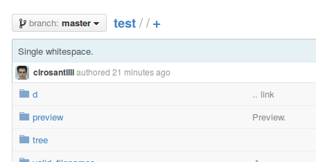

My parent directory filename contains exactly 2 spaces!

As of 2014-11, GitHub:

-   does not list it on the tree show

-   shows up internal files normally with /%20%20/README.md

-   relative links in markdown fail and link to the parent directory instead: [a.md](a.md)

-   if you try to to view it with /%20%20/, shows the parent directory instead instead of the directory, but the breadcrumbs still correctly show as a subdirectory: 
